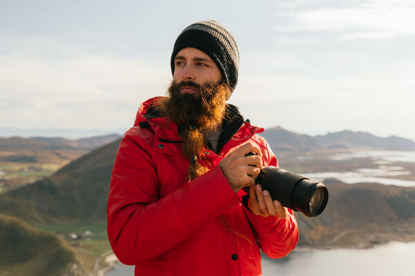

# __¿Quién es Kike Arnaiz? Conoce al Fotógrafo, Creador de Contenido y Viajero Nómada__

Kike Arnaiz, cuyo nombre completo es Enrique Arnaiz Lafuente, es un reconocido fotógrafo profesional, creador de contenido digital y viajero nómada nacido en Aranda de Duero, Burgos, el 8 de agosto de 1992. Su trabajo ha inspirado a miles de personas a explorar el mundo a través de su lente y sus experiencias como nómada digital.

{ align=right }

## __Un Viajero Nómada con Pasión por la Fotografía__

Desde hace varios años, Kike Arnaiz ha adoptado un estilo de vida como nómada digital, viajando por todo el mundo sin una residencia fija. A través de sus redes sociales y su canal de YouTube, comparte consejos de viaje, historias de sus aventuras y fotografías únicas de los rincones más bellos del planeta.

## __Formación y Experiencia Profesional__

Kike Arnaiz estudió Medios Creativos, especializándose en fotografía para cine. Su talento lo llevó a colaborar en la producción de comerciales, cortometrajes y videos musicales para bandas de renombre como La Unión. Además, ha trabajado con diseñadores y agencias de moda en ciudades como Nueva York.

## __Cursos de Fotografía y Viajes en Grupo__

Apasionado por compartir su conocimiento, Kike organiza cursos de fotografía y viajes en grupo. Estas experiencias están diseñadas para ayudar a los participantes a mejorar sus habilidades fotográficas mientras exploran destinos increíbles.

## __Impacto en Redes Sociales__

Kike cuenta con una comunidad creciente de más de 640,000 suscriptores en YouTube y 400,000 seguidores en Instagram. A través de estas plataformas, comparte su visión única del mundo y brinda contenido educativo sobre:

Técnicas de fotografía.

Consejos para viajar barato.

Cómo convertirse en creador de contenido digital.

## __Conecta con Kike Arnaiz__

Para saber más sobre Kike y su trabajo como fotógrafo, creador de contenido y nómada digital, visita sus plataformas:

YouTube: Kike Arnaiz

Instagram: @kikearnaiz

